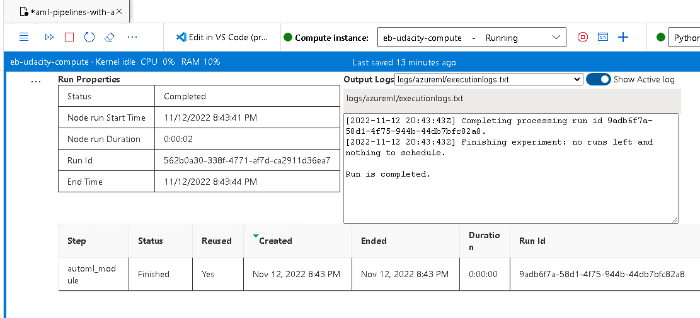

*NOTE:* This file is a template that you can use to create the README for your project. The *TODO* comments below will highlight the information you should be sure to include.

# Udacity MLE Project: Operationalizing Machine Learning
This repo provides a walkthrough of several key components and workflows of modern MLOps, namely: 
1. Deployment of a trained model behind a web API for consumption by client applications
2. Publication of an ML model training workflow (referred to as a *pipeline*) behind a web API, allowing for automated or otherwise programmatic execution of the workflow. 

## Architectural Diagram
</img>

## Key Steps
1. Import the dataset of choice (in this case, the bankmarketing training dataset) and register it in your Azure data store. 

2.  Create and submit an experiment in Azure ML Studio to train an ML model on the dataset. The experiment should then be displayed in your ML Studio Jobs list like the following: 

--Optionally, apply AutoML to your experiment to find the best-performing model for your dataset automatically. 

3. Once the experiment run has completed successfully, select and deploy the best model behind a web service endpoint (for simplicity, we chose an Azure Container Instance as the deployment target in this project). 
4. Ensure that Azure Application Insights is properly configured to stream telemetry logs from your deployment. 

5. Test and validate your deployed ML model endpoint using your preferred client (in this case, the Swagger UI and the Python script endpoint.py). 

6. Apply benchmarking to the model endpoint to assess its baseline performance, using the ApacheBench CLI ab. 

6. Return to your original experiment and create a programmatic training pipeline for it using the AzureML SDK (if not done already in step 2). 

7. After validating your created pipeline, publish it to an Azure Machine Learning Pipeline endpoint. 

8. After publishing, submit a POST request to the endpoint to trigger a new execution of the pipeline (in this case, done using the Jupyter notebook aml-exercise-pipelines-with-automated-machine-learning-step.ipynb). 

## Screen Recording
See a video overview of this project at https://www.loom.com/share/5698d8093018442b8b9650aa120689f6

## Future Directions and Next Steps
1. Complete the loop in this architecture between the published pipeline and the deployed ML model by creating a CI/CD pipeline that redeploys the model to its web service endpoint whenever it has been retrained by a fresh execution of the pipeline. 
2. Set up tighter authentication around the entire workflow via the creation of a Service Principal (not possible in the Udacity-provided environment used this time). 
3. Parameterize the published pipeline to allow for running it with different settings. 
4. Add a data drift monitor to the registered dataset, which calls the published pipeline endpoint to retrain the model after upstream changes to the source data. 

